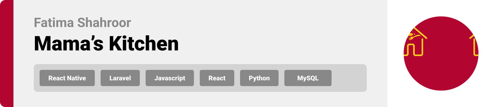
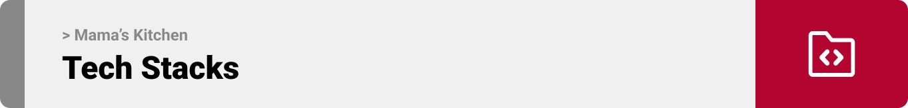
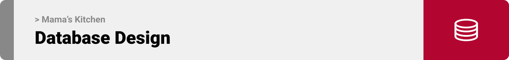
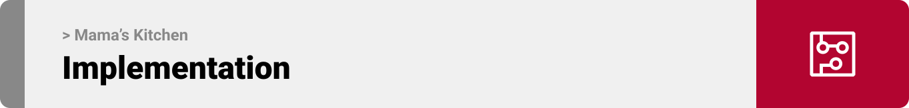

<br><br>

<!-- project philosophy -->


> A mobile app for ordering home-made daily plates, giving cooks the previlige to showcase their culinary skills to customers.
>
> Mama's Kitchen presents to customers a comfortable ordering process by providing a user-friendly platform to place orders, and customize dishes. We believe in enhancing the business of cooks by managing their time and decreasing complexity of ordering food.

### User Stories
#### Cook
- As a cook, I want to receive AI-driven suggestions on how to improve my dishes based on customer feedback and trends so that I can enhance my offerings and satisfy my customers better.

- As a cook, I want the platform to to aid in my business growth by providing tools to share my cooking techniques and dishes, so that I can gain recognition and reach customers directly from home.

- As a cook, I want to manage incoming orders efficiently so that I can ensure timely preparation and delivery without compromising the quality of the food.

#### Customer
- As a customer, I want to customize the ingredients in my food order so that I can tailor meals according to my dietary preferences and allergies.
- As a customer, I want to easily order homemade food so that I can enjoy prepared meals without the hassle of cooking.
- As a customer, I want to be able to express my feedback about ordered dishes so that cooks can enhance their recipes to meet food preferences.

#### Admin
- As an admin, I want to have access of all registered users on the mobile app.
- As an admin, I want to control cooks registration and subscription to the app.
- As an admin, I want to assign roles and permissions to users.

<br><br>
<!-- Tech stack -->


###  Mama's Kitchen is built using the following technologies:

- This project uses the [React-native app development framework](https://reactnative.dev/). React Native is an open-source mobile application framework that allows developers to build natively rendering mobile apps for iOS and Android using JavaScript and React. 
- This project uses also [Laravel php framework](https://laravel.com/). Laravel is is one of the most popular PHP frameworks due to its elegant syntax and robust features. It is intended for the development of web and mobile applications following the model–view–controller (MVC) architectural pattern. 
- The project's database is [MySQL database](https://www.mysql.com/). It is used for small-scale and large-scale applications and is known for its reliability, robustness, and ease of use.
- Plus, the project uses [React Javascript library](https://react.dev/). React is a declarative, efficient, and flexible JavaScript library for building user interfaces. It is used here for the admin panel.

<br><br>
<!-- UI UX -->


> We designed Mama's Kitchen using wireframes and mockups, switching designs until we reached the ideal layout for easy navigation and a seamless user experience.

- Project Figma design [figma](https://www.figma.com/design/m9J4xemV4ZGRN1sSLjAc5L/Final-Project?node-id=0-1&node-type=canvas&t=M5OrSlEXo0UKlDuC-0)


### Mockups
| Login screen  | Home Screen | Order Screen |
| ---| ---| ---|
|  |  |  |

<br><br>

<!-- Database Design -->


###  Architecting Data Excellence: Innovative Database Design Strategies: Using RBAC Security System


<br><br>


<!-- Implementation -->



### User Screens (Mobile)
| Login screen  | Register screen | on Boarding screen | Home screen |
| ---| ---| ---| ---|
|  |  |  |  |
| Dish screen  | Order Screen | Chefs Screen | Checkout Screen |
|  |  |  |  |

### Admin Screens (Web)
| Login screen  | Users screen |  Roles screen |
| ---| ---| ---|
|  |  |  |

<br><br>


<!-- Prompt Engineering -->


###  Mastering AI Interaction: Unveiling the Power of Prompt Engineering:

- This project uses openAI model to optimize the connection between cook's dishes and customers's feedback. By crafting detailed prompts, the AI accurately interprets customer reviews—classifying and detecting emotions, to dynamically suggest potential enhancemnet of the dish recipe primarily based on negative feedback.

<br><br>

<!-- Unit Testing -->


###  Precision in Development: Harnessing the Power of Unit Testing:

- This project employs robust unit testing methodologies to ensure the reliability and accuracy of code components and results. By evaluating individual units of the software, we guarantee efficient outcomes, identifying and addressing potential issues early in the development process.


<br><br>


<!-- How to run -->


> To set up Mama's Kitchen locally, follow these steps:

### Prerequisites

1. First Clone the repository: 
```sh
https://github.com/fatimashahroor/Mama-s-Kitchen.git
```
2. Initiate and update the submodules:
```sh
git submodule init
git submodule update
```


### Installation

1. Navigate to the project directory frontend to install NPM packages: 
* navigation
```sh
cd Mama-s-kitchen-front
```
* set-up
```sh
npm install npm@latest -g
composer install
```
2. Run the app frontend by:
```sh
npm install -g expo-cli
npx expo start
```

Now, you should be able to run Mama's Kitchen locally and explore its features.